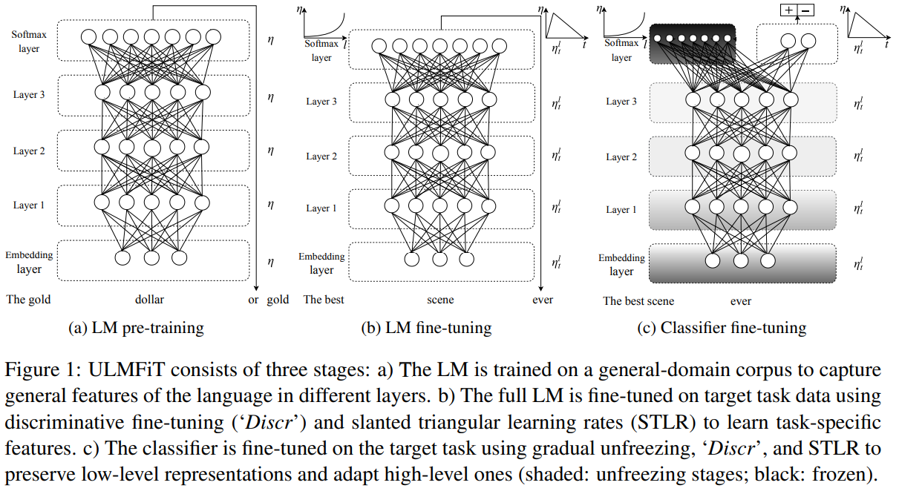
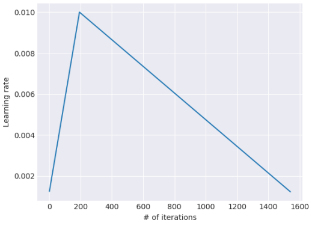
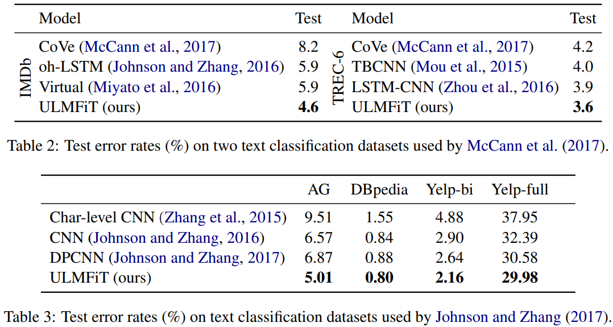
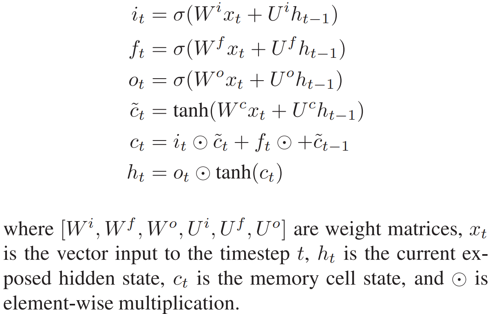
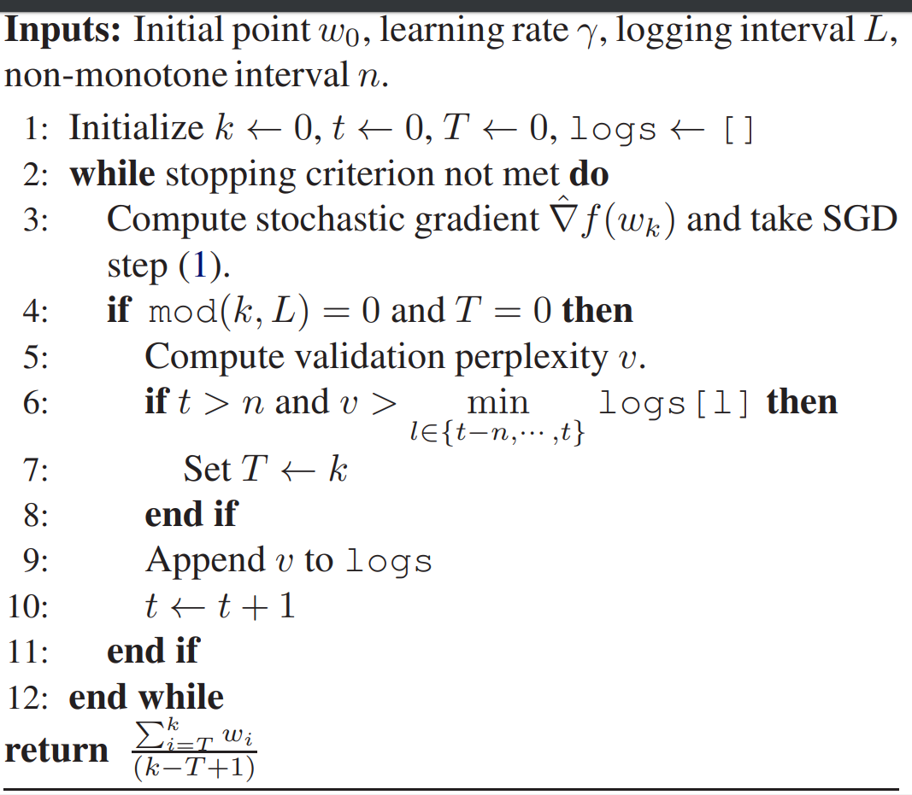
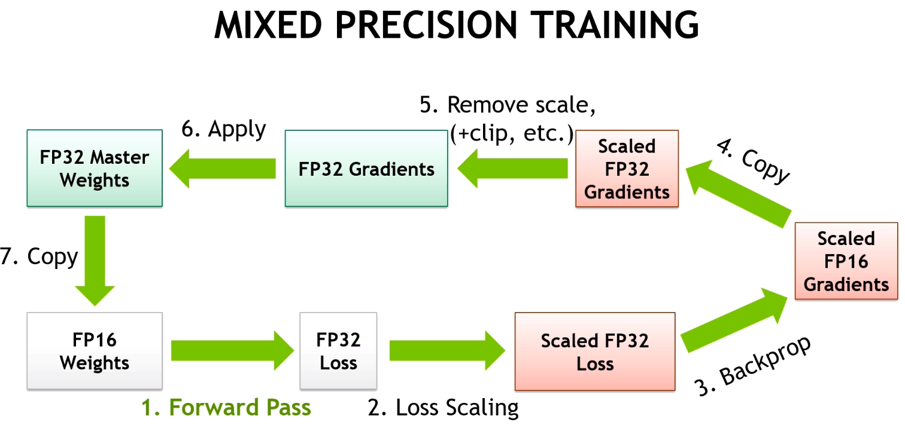
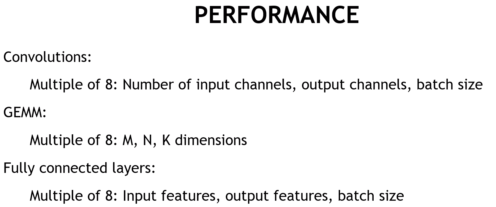

# ULMFiT practical projects

In this repo, we will be reading and understanding two papers in details: the [Universal Language Model Fine_tuning for Text Classification](https://arxiv.org/abs/1801.06146) paper and the [AWD-LSTM paper](https://arxiv.org/pdf/1708.02182.pdf) . Comparing **ULMFiT** to other models that are popularly applied in similar tasks such as language modeling and sentiment classification.

You will find three parts of contents in this repo:

*   a deep dive into [ULMFiT paper](https://arxiv.org/abs/1801.06146) and the [AWD-LSTM paper](https://arxiv.org/pdf/1708.02182.pdf)(the base architecture of ULMFiT)
*   practical application of ULMFiT on IMDB sentiment classification
*   what if we are interested in modeling a language that is not English?

Acknowledgement: Sincere thanks to Jeremy Howard, Sebastian Ruder and Rachel Thomas not just because that they wrote the ULMFiT [paper](https://arxiv.org/abs/1801.06146), but more amazingly, for having developed the [FastAI NLP course](https://www.youtube.com/watch?v=cce8ntxP_XI&list=PLtmWHNX-gukKocXQOkQjuVxglSDYWsSh9) that provides users with interactive tutorials of implementation and practical advices.

## Overview of critical techniques from papers

### ULMFiT

ULMFiT stands for “Universal Language Model Fine-tuning for Text Classification”. 

##### Motivation

It is widely know that in the field of computer vision, **transfer learning** has made a huge impact in both the model performance and the required training time to obtain robust models. On the other hand, existing approaches in **NLP** field, prior to this paper, has largely rely on task-specific modifications and training from scratch. In addition to that, it was not because that **transfer learning** was an unknown technique to the **NLP** specialists, but rather they consider **NLP** as a *special field* where domain knowledge is too task-specific to be built upon any general knowledge training until Jeremy and Sebastian have proven otherwise.

##### Contribution

ULMFiT shines to be the first paper that applies **transfer learning** in the field of **NLP**. In addition, Jeremy et al. introduce techniques that are crucial for **fine-tuning** such a language model.

*“LMs overfit to small datasets and suffered catastrophic forgetting when fine-tuned with a classifier.”* This was what’s hindering the development of applying **transfer learning** in **NLP** prior to ULMFiT. In short, if we bluntly training the entire layers with target task domain data, most of the useful information transfered from source task will be lost, hence denoted as ineffective. This problem was nicely addressed with the **ULMFiT** fine-tuning strategy which we will be getting into details later.

##### Model architecture and training strategy

The base architecture, which is fully responsible for language modeling, is **AWD-LSTM**. Haven’t heard of it? Dont worry, we will be getting into the details of AWD-LSTM paper in the next section. For now, all we need to know is that it is the state-of-the-art language model in 2017 which builds upon a regular **LSTM**(with no attention, short-cut connections, or other sophisticated additions) with various tuned **dropout hyper-parameters**. 

P.S: We can also use a **transformer** in the place of **AWD-LSTM** or basically any high performance language model. However, in this repo, we will be focusing on **AWD-LSTM** since it’s used in the [original paper](https://arxiv.org/pdf/1801.06146.pdf). 

*   Training step 1: **General-domain LM pretrianing**

Similar to what happens in CV transfer learning. Here we will be training our language model(AWD-LSTM) on a large corpus of general knowledge text. (Wiki-103 dataset is used)

*   Training step 2: **Target task LM fine-tuning**

Fine-tuning the language model on the *target task* domain. Techniques such as: *discriminative fine-tuning*, *slanted triangular learning rates* are used. (we will be getting into the details later)

*   Training step 3: **Target task classifier fine-tuning**

Classifier layers are added to the model structure, and we start to training the model on the actual task.

##### Important fine-tuning techniques

As mentioned before, **ULMFiT** has incorporated several powerful fine-tuning techniques that made the **robust inductive transfer learning** all possible.

**Discriminative fine-tuning**. As different layers capture different types of information, they should be fine-tuned to different extent(at different learning rate). In this implementation, the learning rate of the current layer is simply $\frac{1}{2.6}$ of the last layer.(with the top layer have highest learning rate).

**Slanted triangular learning rates**. This is an specific implementation of learning rate scheduling, in that we apply different learning rates at different stages of the training. The one used in **ULMFiT** looks like this:

**Gradual unfreezing**. Rather than fine-tuning all layers at once, which risks *catastrophic forgetting*. Jeremy et al. found that by gradually unfreezing the layers from top-to-bottom greatly mitigate this issue. This was because the top layer contains the **least general** knowledge, and we should fine-tune the most *sensitive* layers(bottom layers) last when top layers are relatively stable.

**Bidirectional language model**. Training a **forward LM** that read in the default direction and training a **backward LM** that read backwards. Then combine the decision made by the two model in some manner(could be simply taking the average). This technique is likely to further improve the model accuracy.

##### Performance comparison with similar models

### AWD-LSTM paper

Recurrent neural networks serves as a fundamental building block for many sequence learning tasks before the **transformer** came along. The **ULMFiT** method adopts one high performance variation that features *weight-dropped* **Long short-term memory (LSTM)**. In addition, a novel optimizer (**NT-ASGD**) was proposed to be applied in the training strategy.

##### Weight-dropped LSTM

LSTM can be formulated as:

**DropConnect** was implemented in the architecture in that weight matrices are *dropped* before the *forward* and *backward* pass.

**Variational dropout**. In standard dropout, a new binary dropout mask is sampled each and every time the dropout function is called. **Variational dropout** only samples a *dropout mask* upon the first call and then will repeatedly use that *locked dropout* mask for all repeated connections within the forward and backward pass.

The values used for *dropout on the word vectors*, the *output between LSTM layers*, the *output of the final LSTM layer*, and *embedding dropout* were (0.4, 0.3, 0.4, 0.1), respectively.

##### Non-monotonically Triggered ASGD(NT-ASGD)

This a variation of **averaged Stochastic Gradient Descend** which goes as follows:

## ULMFiT Basics and implementation in sentiment analysis

If you are familiar with the techniques FastAI endorses when implementing transfer learning, the pipeline should look very familiar to you.(If not, check out my [other repo](https://github.com/Sylar257/Skin-cancer-detection-with-stacking)) In order to build a deep learning model that classifies IMDb reviews, we only need 4 step:

1.  Loading IMDb data and exploratory data analysis(EDA)
2.  Formatting the data in a way that is ready for your DL framework of choice(in this case FastAI)
3.  Fine-tuning the language model (from general wiki-text to domain specific)
4.  Building a classifier on top of the fine-tuned language model

Contrary to Image transfer learning, texts can’t be directly transformed into numbers and be fed into our model. We need to conduct a two-step process, firstly **tokenized** the texts as a list of words(usually a vocabulary is associated) and secondly pass the tokenized words through an embedding layer to **numericalize** them

### Mixed Precision Training

The motivation is to reduced both the amount of **computation** made in the network as well as **storage** required at the cost of using less precise data (fp16 is essentially half-precision as compared to fp 32). As a result, we will have *faster training* and potentially *better performance*.

*   *It turns our that  sometimes, making things less precise in deep learning causes it to generalize a bit better.*

    													-*Jeremy Howard*

The details about mixed precision training can be found in [NVIDIA’s documentation](https://docs.nvidia.com/deeplearning/sdk/mixed-precision-training/index.html). Simply put, NVIDIA has done a great job to optimize the GPU training process by converting part of the computation into half-precision-points such as **back-prop’s gradients**, **activations in the forward pass**.

The following is the recommended model architecture recommended by NVIDIA for best GPU effciency:

